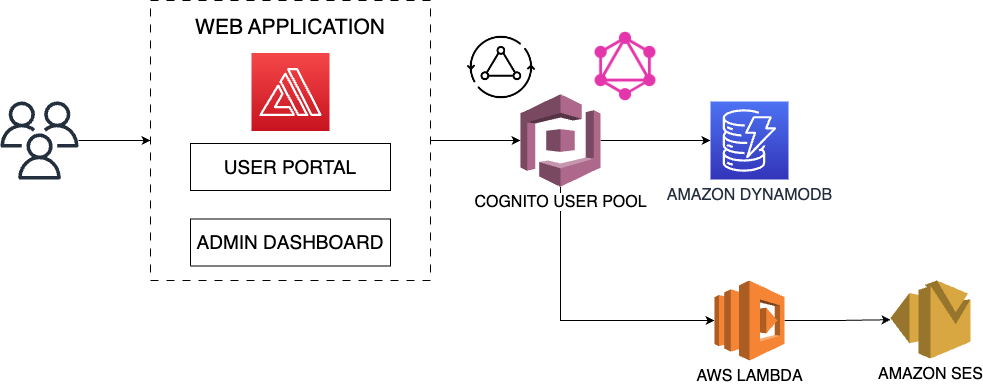

## About The Project

This project looks at creating a web app with the ability to add new records, send notifications on app activity and also view data from the DynamoDB. Our team was tasked to recommend 2 solutions for this app and design 1 out of the 2. For the development of this app we opted for the severless architecture.

### Collaborations

This is a hand-on cloud engineering project delivered by the Azubi Africa Cloud Team(Team Agile) in 2023. After 6 months of AWS cloud training and front-end development, we got a chance to work on some realife cloud projects.
The team members below made this project successful :

1.  Joseph W Wafula [@their_linkedin]()
2.  Kevin Rwema [@kevin-rwema](https://www.linkedin.com/in/kevin-rwema/)
3.  Moses Boriowo [@moses-boriowo](https://www.linkedin.com/in/moses-boriowo/)
4.  Leonard Agyenim Boateng [@their_linkedin]()
5.  Mamadou Amadou Kebe [@mamadou-ammadou-kebe-994aa95a](https://www.linkedin.com/in/mamadou-ammadou-kebe-994aa95a/)
6.  Iraguha Benjamin[@their_linkedin]()
7.  Kennedy Manda [@their_linkedin]()
8.  Michael Theuri Munyori [@michael-munyori](https://www.linkedin.com/in/michael-munyori/)
9.  Tabitha Mutiso [@their_linkedin]()
10. Leslie Narh [@leslienarh](https://www.linkedin.com/in/leslienarh/)

## Technologies and tools used

- Git and GitHub
- ReactJS
- NodeJS
- AWS Amplify
- AWS GrapQL
- AWS Dynamo DB
- AWS SES

## The Solution



An AWS Amplify web app using React, with AWS Cognito for user management, GraphQL for the backend, and DynamoDB as the database.

## Getting started

If you don't already have an AWS account or have the Amplify CLI installed, follow this <a href="https://docs.amplify.aws/start/getting-started/installation/q/integration/next/#install-and-configure-the-amplify-cli">guide.
</a>

The Amplify services we'll need for our backend are in the following order:

- Cognito: Customer identity and access management
- AppSync: Fully managed GraphQL API
- DynamoDB: NoSQL database
- Lambda: FaaS/cloud function

1. Once setup clone the repo. After cloning the repo install the dependencies.

- `git clone git@github.com:tettehnarh/azubi_cloud_project_3.git` to clone the repo
- `cd azubi_cloud_project_3` change directory to the cloned repo
- `npm install` install dependencies

2. Install the Amplify CLI globally on your machine.
   `npm install -g @aws-amplify/cli`

3. Initialize your backend
   `amplify init`

4. Add an API
   `amplify add api`

5. Setup our functio trigger
   `amplify add function`

```javascript:
const aws = require("aws-sdk");
const ses = new aws.SES();

exports.handler = async (event) => {
  for (const streamedItem of event.Records) {
    if (
      streamedItem.eventName === "INSERT" ||
      streamedItem.eventName === "MODIFY"
    ) {
      const userEmail = streamedItem.dynamodb.NewImage.userName.S;

      await ses
        .sendEmail({
          Destination: {
            ToAddresses: [userEmail],
          },
          Source: process.env.SES_EMAIL,
          Message: {
            Subject: { Data: "Welcome to Gold Grid" },
            Body: {
              Text: {
                Data: "Thank you for filling out the form. Welcome to the Gold Grid family.",
              },
            },
          },
        })
        .promise();
    }
  }
  return { status: "done" };
};
```

4. Setup SES

5. Updating our Lambda

6. Push up our backend
